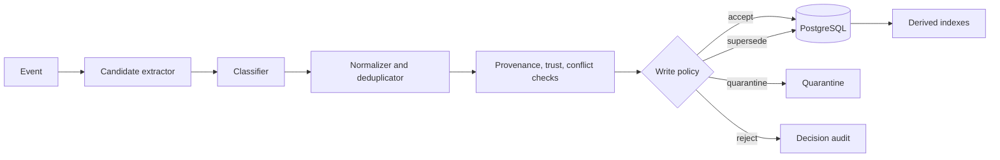

# Architecture

## Purpose

The Long-Term Agent Memory OS preserves useful information across agent
sessions while preventing stale, contradictory, untrusted, or cross-tenant
data from entering an agent's context. It is independently testable and can be
integrated into a LangGraph runtime without making that runtime the owner of
memory semantics.

## Architectural principles

1. PostgreSQL is the source of truth. Search indexes are rebuildable views.
2. An event is evidence; a memory is a governed interpretation of evidence.
3. Write policy is deterministic and separate from LLM reasoning.
4. Tenant, trust, status, and temporal constraints are applied before ranking
   whenever possible and revalidated before context construction.
5. Provenance survives consolidation, supersession, expiry, and tombstoning.
6. Retrieval quality is measured against labeled data under a fixed token
   budget.

## Memory lifecycle

```text
event
  -> candidate extraction
  -> classification
  -> normalization and deduplication
  -> provenance and trust assessment
  -> temporal/conflict check
  -> write decision (accept, supersede, quarantine, reject)
  -> authoritative persistence
  -> derived lexical/vector indexing
  -> filtered hybrid retrieval
  -> reranking
  -> temporal/conflict resolution
  -> token-budget context packing
  -> access feedback
  -> consolidation, expiry, or tombstone
```

Skipping policy at ingestion cannot be repaired by a more sophisticated
retriever. Rejected candidates retain an auditable decision without becoming
active memory; quarantined candidates are unavailable to normal retrieval.

## Conceptual model

### Event

An immutable observation from a known source: a conversation turn, tool result,
configuration snapshot, agent action, or outcome. Events carry tenant scope,
source identity, timestamps, integrity metadata, and raw or referenced content.
They are evidence, not automatically memory.

### Memory candidate

A proposed durable interpretation extracted from one or more events. It has a
proposed memory type, normalized content, subject/entity keys, confidence,
provenance references, validity hints, and an initial trust assessment. A
candidate cannot enter retrieval until write policy makes a recorded decision.

### Accepted memory record

An authoritative, versioned record with, at minimum:

- stable memory and tenant identifiers;
- memory type, normalized content, and status;
- subject/entity keys and optional structured attributes;
- `valid_from`, optional `valid_to`, creation time, and update time;
- confidence and trust level;
- immutable provenance links to supporting events;
- supersession/conflict relationships and resolution state;
- creator/policy version and audit metadata.

Working memory is deliberately excluded from this long-term record model unless
it passes an explicit promotion policy.

## Memory classification and promotion

| Type | Meaning | Admission rule | Change rule |
| --- | --- | --- | --- |
| Working | Current hypotheses and pending work | Runtime state only | Ends with run/thread |
| Episodic | What happened | Trusted execution evidence | Immutable; ranking may decay |
| Semantic | A durable fact | Provenance plus confidence and conflict check | Superseded or invalidated |
| Procedural | A reusable method | Repeated supporting episodes or explicit approval | Versioned and deprecable |

Promotion creates a new record linked to all supporting evidence; it does not
mutate an episode into another type or discard the original episodes.

## Write path



The LLM may propose candidates or explanations but cannot authorize writes.
Persistence and provenance links are committed transactionally. External
indexes, if introduced, are updated asynchronously and reconciled against
PostgreSQL.

## Retrieval path

1. Understand the query into tenant/user scope, allowed types, entities, time
   window, lexical terms, semantic text, and candidate limit.
2. Apply hard tenant, status, validity, type, and trust filters.
3. Retrieve lexical candidates with PostgreSQL FTS and semantic candidates
   with exact pgvector search.
4. Fuse candidate ranks using a documented, configurable strategy.
5. Rerank a bounded set with a CrossEncoder.
6. remove expired, superseded, quarantined, unauthorized, or unresolved
   conflicting records.
7. Pack a diverse, non-redundant set within the configured token budget.
8. Revalidate authoritative records immediately before context construction.

Ranking scores influence relevance only. They never override authorization,
trust, temporal validity, or conflict state.

## Temporal and conflict semantics

`valid_from` and `valid_to` describe when a claim applies, while creation and
observation timestamps describe when the system learned it. A newer trusted
fact can supersede an older fact without deleting history. A contradiction is
explicitly related to the competing records and remains unresolved until a
deterministic rule or authorized review selects a resolution. Queries can use
an `as_of` time and never choose a stale fact solely because it is more
semantically similar.

## Trust and poisoning model

Trust is derived from source class, source identity, integrity, corroboration,
and policy—not from model confidence alone. User attempts to alter safety
policy, prompt injection in tool output, unverifiable model statements, and
cross-tenant references are rejected or quarantined. Procedural promotion has
the strictest admission rule because it can shape future agent behavior.

## Tenant isolation

Every event, candidate, record, relation, provenance link, index entry, and
access log is tenant-scoped. Tenant identity comes from authenticated runtime
context and cannot be supplied or overridden by recalled text. Database queries
require tenant predicates; retrieval results are revalidated against the
authoritative store. The acceptance target for cross-tenant retrieval is zero.

## Forgetting and deletion

Forgetting is a policy transition: ranking decay, expiry, archive, compaction,
or tombstoning. Tombstones prevent deleted material from being reintroduced by
reconciliation or consolidation. Hard deletion is reserved for explicit
retention/privacy requirements and follows a recorded, cascading purge across
derived indexes while retaining only legally permissible audit evidence.

## Integration boundaries

- **LangGraph:** invokes read-before-reason and write-after-observation stages;
  it does not define memory authority.
- **Ollama:** proposes structured candidates, summaries, or conflict
  explanations; outputs are untrusted inputs to deterministic policy.
- **sentence-transformers:** produces embeddings and bounded reranking scores.
- **PostgreSQL/pgvector/FTS:** owns authoritative records and baseline search.
- **TurboVec (optional experiment):** a rebuildable external vector index using
  stable memory IDs and mandatory PostgreSQL revalidation.
- **OpenTelemetry:** traces each lifecycle stage without exposing memory content
  or secrets in telemetry by default.

## Failure handling

- A failed index update leaves the authoritative record active with an index
  state that a retry/reconciliation worker can repair.
- A ghost external-index ID is ignored and removed because it cannot resolve to
  an active, authorized PostgreSQL record.
- Partial candidate processing is idempotent by event/candidate identity.
- Retrieval degrades to available mechanisms; it never relaxes hard filters.
- Consolidation is retryable and preserves links to all supporting memories.

## Observability and validation

Trace candidate extraction, write policy, persistence, indexing, lexical and
vector retrieval, reranking, temporal resolution, context packing,
consolidation, and forgetting. Track decisions by type, latency, benchmark
quality, stale/conflict hits, poison rejections, blocked tenant violations, and
memory-context token cost. Never use raw sensitive memory content as a metric
label.

The architecture is accepted only when provenance is complete, tenant leakage
is zero in tests, stale facts cannot outrank active facts, poisoning policy is
measured, and memory-enabled performance improves on a held-out longitudinal
benchmark without uncontrolled context growth.
