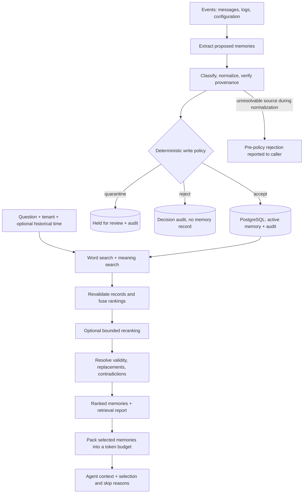

# Long-Term Agent Memory OS

A local-first memory service for AI agents that tracks **where information
came from, when it applies, and whether it should enter the agent's context**.

It implements governed ingestion, hybrid retrieval, optional reranking,
temporal conflict resolution, and token-budget context packing. Decisions
are inspectable through provenance, write-policy audits, retrieval reports,
and per-memory selection reasons.

**Status:** under active development. The core pipelines and a development
HTTP API and LangGraph integration are implemented; scheduled consolidation
and lifecycle workers remain planned. The HTTP API is a local development
tool, not a production deployment surface.

[See an example](#a-memory-that-changes-over-time) ·
[Architecture](#how-the-system-fits-together) ·
[Evaluations](#what-has-been-measured) ·
[Run locally](#quick-start) ·
[Implementation status](#implementation-status) ·
[Documentation](#explore-the-design)

## The problem

An agent may remember a configuration that has changed, retrieve two
contradictory claims, or spend most of its prompt space on repeated incident
reports. A relevant search result alone does not tell it which information
is current, sufficiently trusted, or worth the available space.

This project makes those decisions explicit. An incoming note must pass
write policy before becoming active memory. A retrieved note must pass
eligibility and temporal checks before it can enter the agent's context.

## A memory that changes over time

Imagine an engineer asking about checkout-api timeouts. The following is an
illustrative scenario; replacement and contradiction links are explicitly
recorded, not automatically inferred during ingestion.

| Situation | System behavior | Why it matters |
| --- | --- | --- |
| The timeout changes from 5 seconds to 2 seconds on March 1 | A recorded replacement closes the old validity window and preserves both records | Current reads can use the new value without erasing history |
| The engineer asks what applied on February 15 | An `as_of` query can return the old 5-second value | Historical questions use the requested time |
| Two current claims disagree and have equal trust | A recorded contradiction withholds both and appears in the conflict report | A high search score does not arbitrarily settle the disagreement |
| Ten incident reports repeat the same issue | Context packing discounts overlap and can keep a fact, an incident, and a procedure within the budget | Repetition need not crowd out complementary information |
| A proposed memory cites missing or inconsistent evidence | Normalization or provenance verification rejects the proposal | A model's proposal does not approve its own admission |

These rules act on recorded sources, dates, types, and relationships. They
do not independently prove real-world truth. Outcomes also depend on which
memories retrieval finds and the query's filters.

## How the system fits together



PostgreSQL is the authoritative store for content, tenant ownership,
provenance, trust, validity, relationships, and audit decisions. Full-text
search and pgvector embeddings are derived retrieval mechanisms. New active
memories need indexing before meaning-based search can find them.

The durable memory types are **episodic** (events and observations),
**semantic** (standing facts), and **procedural** (repeatable methods).
Procedures have a stricter admission policy. Working memory belongs to the
agent's current runtime. [LangGraph integration](docs/langgraph-integration.md)
reads packed long-term memory before reasoning and learns through write policy
after completed tool outcomes.

**Implementation stack:** Python 3.12+, PostgreSQL 17 with pgvector,
SQLAlchemy and Alembic, Pydantic, and FastAPI. Local sentence-transformers
models provide embeddings and reranking; Ollama provides LLM extraction.
Models may download on first use and run locally afterward.

## Engineering decisions and their evidence

| Decision | Reason | Implementation and evidence |
| --- | --- | --- |
| The LLM proposes; deterministic policy decides | Extraction confidence must not authorize a write | [Write policy](apps/memory_service/ingestion/write_policy.py), [policy tests](apps/tests/unit/ingestion/test_write_policy.py), [trust ADR](docs/adr/006-memory-trust-and-poisoning.md) |
| Provenance and tenant scope travel with each memory | A result must be attributable and scoped before ranking can matter | [Provenance verification](apps/memory_service/ingestion/provenance.py), [persistence tests](apps/tests/integration/persistence/test_memory_repository.py) |
| Records are revalidated after search | Search representations must not override current record eligibility | [Retrieval flow](docs/retrieval-flow.md), [temporal ADR](docs/adr/004-temporal-conflict-semantics.md) |
| Historical windows and explicit conflict links govern validity | Similarity and recency do not settle conflicting claims | [Temporal resolver](apps/memory_service/retrieval/temporal.py), [end-to-end tests](apps/tests/integration/retrieval/test_temporal_resolution.py) |
| Reranking scores a bounded shortlist and falls back on handled errors | Improve ordering while limiting the number of scored pairs | [Reranker](apps/memory_service/retrieval/reranker.py), [fallback and cap tests](apps/tests/unit/retrieval/test_reranker.py) |
| Context selection considers overlap and token cost | The highest-ranked notes may repeat one another or consume too much space | [Context packer](apps/memory_service/retrieval/context_packer.py), [budget and selection tests](apps/tests/unit/retrieval/test_context_packer.py) |
| Exact vector search precedes approximate indexing | Establish a measurable quality baseline before trading accuracy for speed | [Retrieval ADR](docs/adr/003-hybrid-retrieval.md), [search-quality tests](apps/tests/integration/retrieval/test_exact_search_quality.py) |
| Poisoning defenses are measured against an attack corpus | Rules that only look right cannot show how much poison gets through | [Security modules](apps/memory_service/security), [adversarial tests](tests/adversarial), [trust and poisoning guide](docs/trust-and-poisoning.md) |

The API exposes intermediate evidence: `/retrieve` returns ranking signals,
reranking fallback information, and temporal exclusions; `/context` returns
selected memories, skip reasons, and budget statistics. These reports make
unexpected results traceable to a particular stage.

## What has been measured

These are **previously recorded development results**, not production-scale
claims or a fresh benchmark run. Each retrieval comparison uses the same
candidate pool for both strategies. Full methodology and caveats live in the
linked guides.

### Retrieval quality and reranking cost

Dataset: 24 memories, 16 queries with deliberately similar but incorrect
alternatives. **Precision@5** is the number of distinct answer memories in
the top five divided by five; **Recall@5** is the fraction of required
answers found. For example, finding one required answer among five results
gives recall 1.0 and precision 0.2. **MRR** rewards placing the first
relevant answer early;
**nDCG@5** measures top-five ordering against an ideal relevance order.
Higher is better. **P50/P95** are median and 95th-percentile latency.

| Strategy | Precision@5 | Recall@5 | MRR | nDCG@5 | Reranking P50 / P95 |
| --- | ---: | ---: | ---: | ---: | ---: |
| Hybrid search | 0.200 | 1.000 | 0.906 | 0.952 | — |
| Hybrid + CrossEncoder | 0.200 | 1.000 | 0.938 | 0.964 | 7.8 / 9.6 ms |

Precision@5 is derived from the previously recorded Recall@5 of 1.0 and
the dataset's one grade-2 answer per query; it cannot exceed 0.2 here.
Precision, recall, and MRR count grade-2 answers; nDCG also credits grade-1
context. The reranker improved two
first-answer positions and worsened one; timings depend on hardware and
exclude the experience of a cold model load. See
[retrieval measurements](docs/retrieval-flow.md#reranking-measured-quality-and-cost).

### Useful context under a tight budget

Dataset: 24 memories, four queries, real embeddings, subject keys enabled,
no reranking. At a **150-token budget**, coverage is the share of useful
information groups represented, and duplicate rate is the share of selected
notes repeating an already represented labeled group.

| Strategy | Duplicate rate ↓ | Useful-group coverage ↑ | Precision ↑ |
| --- | ---: | ---: | ---: |
| Fill in rank order | 0.33 | 0.50 | 0.78 |
| Context packer | 0.00 | 0.75 | 0.78 |

The tradeoff is visible at larger budgets: at 500 tokens, coverage is 1.0
for both strategies, but precision falls from 0.53 for rank order to 0.25
for packing. Without an absolute relevance threshold, the packer can use
remaining space on off-topic notes. See the
[full context-packing results](docs/context-packing.md#5-measurements-does-this-help).

### Poisoning and tenant isolation

Corpus: 39 labeled attacks in eight families (safety overrides, tool-output
injection, secret persistence, model claims, hallucinated extraction,
poisoned procedures, stale facts, cross-tenant evidence) and 14 benign
controls, run through extraction, normalization, and write policy. **Poison
acceptance** is the share of attacks that became active memory; **benign
acceptance** shows the policy is not simply refusing everything.

| Measure | Result (2026-10-03) |
| --- | ---: |
| Poison acceptance | 0 / 39 (0%): 16 quarantined, 23 rejected |
| Benign acceptance | 14 / 14 (100%), including two legitimate supersessions |
| Decisions without a reason code | 0 |
| Tenant B results belonging to tenant A, across every read path and the API | 0 |

The results were identical in memory and through PostgreSQL. The corpus was
written together with the defenses, so 0% shows that the known families are
handled, not that novel phrasings will be caught. See the
[poisoning measurements and limitations](docs/trust-and-poisoning.md#5-measurements-how-much-poison-gets-through).

After local setup, reproduce the evaluations with:

```bash
uv run python -m apps.benchmark.run_retrieval_eval
uv run python -m apps.benchmark.run_context_packing_eval
uv run python -m apps.benchmark.run_poisoning_eval   # add --database for PostgreSQL
uv run python -m apps.benchmark.run_langgraph_store_eval
uv run python -m apps.benchmark.run_longitudinal_eval
uv run python -m apps.benchmark.run_capability_eval
```

The first two require PostgreSQL and the relevant local models; the
poisoning runner needs neither unless given `--database`. The Store comparison
and longitudinal replay use PostgreSQL inside rollback-only transactions and
deterministic hash embeddings, with no model download. Their measured reports
and limits are documented in the [Store comparison](docs/langgraph-store-comparison.md)
and [longitudinal benchmark](docs/longitudinal-benchmark.md).

The [seven capability benchmarks](docs/capability-benchmarks.md) produce
separate Markdown learning reports and JSON traces for answer quality,
reasoning, extraction, write policy, conflict resolution, forgetting, and
prompt packing. They use independent fixture/profile files, the existing
PostgreSQL database in rollback-only transactions, and installed local Ollama
models. Start with the [measured reports](docs/reports/capabilities-initial/README.md)
and use a fresh output directory for each comparison.

The optional [Phase 6B vector comparison](docs/vector-backend-comparison.md)
tests pgvector exact search, pgvector HNSW and a compressed TurboVec index on
the same prepared MemoryAgentBench chunks and queries. It includes committed
write failures, stale tombstones, tenant isolation and actual reconciliation.
See the [measured comparison](docs/reports/vector-backend-comparison.md) for
quality, latency, throughput, storage and recovery costs. The normal service
continues to use PostgreSQL retrieval.

## Quick start

### 1. Start the database and development API

Prerequisites: Python 3.12+, `uv`, Docker with Compose, `curl`, and `jq`.
Run from the repository root. The prepared retrieval demo below does not
require Ollama; the first model use may require a download.

```bash
# Keep your existing .env if already configured.
[ -f .env ] || cp .env.example .env
uv sync --all-groups
docker compose up -d --wait postgres
uv run alembic upgrade head
uv run uvicorn apps.memory_service.api.app:app --reload --port 8000
```

Leave the API running. Its interactive reference is at
[localhost:8000/docs](http://localhost:8000/docs).

### 2. Create a tenant and load the prepared demo

Run in another terminal. A tenant is the account or organization that owns
its memories. Choose an unused name if you have run this before.

```bash
TENANT_ID=$(curl -fsS -X POST http://localhost:8000/tenants \
  -H 'Content-Type: application/json' \
  -d '{"name":"memory-walkthrough"}' | jq -er .tenant_id)

curl -fsS -X POST \
  "http://localhost:8000/tenants/$TENANT_ID/demo/seed" | jq
```

The seed creates and indexes prepared records, including old and new timeout
settings and recorded contradictions. It directly constructs demonstration
fixtures; it does not exercise LLM extraction or write-policy admission.
Seeding a tenant that already has active memories returns HTTP 409.

### 3. Compare historical and later retrieval

```bash
curl -fsS -X POST "http://localhost:8000/tenants/$TENANT_ID/retrieve" \
  -H 'Content-Type: application/json' \
  -d '{"query_text":"request timeout","as_of":"2026-02-15T00:00:00Z","limit":5,"rerank":true}' | jq

curl -fsS -X POST "http://localhost:8000/tenants/$TENANT_ID/retrieve" \
  -H 'Content-Type: application/json' \
  -d '{"query_text":"request timeout","as_of":"2026-04-01T00:00:00Z","limit":5,"rerank":true}' | jq
```

For the seeded timeout pair, February admits the 5-second setting; April
admits the replacement 2-second setting. Inspect `hits` and `pipeline` for
ranking and resolution details. Other matches can appear because retrieval
has no absolute relevance floor. Omit `as_of` to ask about now.

### 4. Inspect the context the agent would receive

```bash
curl -fsS -X POST "http://localhost:8000/tenants/$TENANT_ID/context" \
  -H 'Content-Type: application/json' \
  -d '{"query_text":"request timeout","as_of":"2026-04-01T00:00:00Z","token_budget":200,"candidates":30,"rerank":true}' \
  | jq '{context, skipped, stats}'
```

`context` is the formatted prompt text; `skipped` explains omissions;
`stats` reports selection counts and token usage. The budget holds according
to the configured counter. The default counter is an estimate; Python callers
can supply the agent's tokenizer for model-specific accounting.

### 5. Try ingestion from actual events

For the complete write path, start Ollama and pull `qwen2.5:7b-instruct`
(or configure `OLLAMA_MODEL`). The following uses the tenant created above:

```bash
ollama pull qwen2.5:7b-instruct

EVENT_ID=$(curl -fsS -X POST "http://localhost:8000/tenants/$TENANT_ID/events" \
  -H 'Content-Type: application/json' \
  -d '{"source_type":"configuration","source_reference":"checkout-api/config-demo","content":"checkout-api max_retries=3"}' \
  | jq -er .event_id)

curl -fsS -X POST \
  "http://localhost:8000/tenants/$TENANT_ID/events/$EVENT_ID/ingest" | jq

curl -fsS -X POST \
  "http://localhost:8000/tenants/$TENANT_ID/memories/index" | jq
```

Inspect the ingestion outcome: model extraction can vary, and only accepted
memories become active. Indexing computes missing embeddings for active
memories. Repeat retrieval or context requests with the question
`checkout-api max_retries` to explore the new note. See the
[ingestion walkthrough](docs/ingestion-flow.md) for acceptance, quarantine,
and rejection examples.

## Implementation status

| Area | Implemented | Remaining work |
| --- | --- | --- |
| Storage and governance | Tenant-scoped records, provenance, trust, audited expiry/tombstones, decay, compaction, maintenance CLI | Deployment scheduling, retention-specific purge |
| Ingestion | Ollama extraction, deterministic classification, normalization, verification, write policy with poisoning, model-claim, procedure-evidence, and stale-fact checks; supersession of recognized fact claims | Contradiction links, broader fact matching, quarantine review tooling |
| Retrieval | Full-text and exact vector search, rank fusion, bounded optional reranking | Approximate indexes when justified by evaluation |
| Optional Phase 6B | Measured pgvector exact/HNSW and TurboVec adapters; transactional external-index outbox, sync worker, authoritative revalidation and reconciliation | Larger-scale evidence, multi-process serving and deployment scheduling before adopting a second index |
| Temporal behavior | Historical queries, recorded supersession, trust-based conflict resolution | Future-dated replacement edge cases; optional return of unresolved claims in hits |
| Context packing | Duplicate removal, overlap-aware selection, budget accounting, skip reports | Calibrated relevance floor and improved subject-key quality |
| Consolidation | Deterministic episode clustering, bounded candidates, evidence thresholds, policy-governed persistence | Scheduled worker, summary refresh/supersession, global deduplication |
| Agent integration | Development HTTP API, Python pipeline entry points, LangGraph read-before-reason and governed outcome learning, usefulness feedback | Working-memory lifecycle, replay deduplication |
| Evaluation | Retrieval/context-packing comparisons; poisoning corpus; isolated LangGraph Store comparison; seven-session longitudinal replay with a no-memory control; unit, integration and adversarial tests | Larger datasets, real-model longitudinal task trials |

Further limitations: provenance verification checks references and metadata,
not whether an extracted sentence is logically supported (only numbers are
checked against the evidence). Injection and tampering checks use fixed
patterns; see [poisoning limitations](docs/trust-and-poisoning.md#6-limitations-to-keep-in-mind). Consolidation has a Python entry point;
[forgetting maintenance](docs/forgetting.md) has a schedulable CLI. Deployment
schedules and hard-delete retention policies are not installed automatically. See [temporal limitations](docs/temporal-resolution.md#known-limitations)
and [packing limitations](docs/context-packing.md#6-limitations-to-keep-in-mind)
for the precise boundaries.

## Development and validation

```bash
uv run pytest apps/tests/unit tests/unit
uv run pytest apps/tests/integration tests/integration
uv run pytest tests/adversarial
uv run ruff check .
uv run mypy apps integrations
```

Integration tests use a separate database by default (`agent_memory_test`
with the example configuration), create and drop its tables, and roll back
each test's transaction. Set `TEST_DATABASE_URL` only to a disposable test
database. Database-dependent tests skip if PostgreSQL is unreachable;
real-model tests also need the relevant models.

The tests include stale facts outranking current ones, conflicts whose other
side was not retrieved, tenant isolation, rejected evidence, reranker
fallback, and token counters that count joined text differently from its
parts. The [adversarial suite](tests/adversarial) attacks write policy with
poisoned, stale, and cross-tenant input. See [the test suite](apps/tests) and
[database operations](docs/database-operations.md) for local inspection.

## Explore the design

| Read next | What it explains |
| --- | --- |
| [Memory attributes and lifecycle](docs/memory-attributes-and-lifecycle.md) | Hub-and-spoke view of a record and a state-machine view of its lifecycle |
| [Ingestion](docs/ingestion-flow.md) | How evidence becomes an accepted, quarantined, or rejected memory |
| [Trust and poisoning](docs/trust-and-poisoning.md) | Evidence trust, poisoning checks, stale facts, tenant scope, and how they are measured |
| [Retrieval](docs/retrieval-flow.md) | Word and meaning search, fusion, filters, and reports |
| [Reranking](docs/reranking.md) | Joint question–memory scoring, bounds, and fallback |
| [Temporal resolution](docs/temporal-resolution.md) | Historical validity, supersession, and contradictions |
| [Context packing](docs/context-packing.md) | Useful information under a prompt-space budget |
| [LangGraph integration](docs/langgraph-integration.md) | Read packed memory before reasoning, learn from completed tool outcomes, and record usefulness |
| [LangGraph Store comparison](docs/langgraph-store-comparison.md) | Measured primitive capabilities and the boundary with the authoritative PostgreSQL model |
| [Longitudinal benchmark](docs/longitudinal-benchmark.md) | Multi-session recall, changed facts, poison, tenant scope, budgets, and explicit forgetting |
| [MemoryAgentBench retrieval benchmark](docs/memory-agent-bench.md) | Independent Hugging Face dataset, retrieval diagnostics, and reproducible learning reports |
| [Memory capability benchmarks](docs/capability-benchmarks.md) | Seven independent tracks with local Ollama, production policy/lifecycle checks, and Markdown learning reports |
| [Vector backend comparison](docs/vector-backend-comparison.md) | Optional Phase 6B: pgvector exact/HNSW versus TurboVec, authoritative reads, durable sync, failure recovery and measured operational costs |
| [Consolidation clustering](docs/consolidation-clustering.md) | Group related episodes by tenant, subject, category, and time |
| [Consolidation summaries](docs/consolidation-summaries.md) | Bounded candidates with complete supporting evidence |
| [Consolidation promotion](docs/consolidation-promotion.md) | Decide whether repetition supports an observation or procedure |
| [Consolidation service](docs/consolidation-service.md) | Write policy, atomic persistence, and repeat-run deduplication |
| [Forgetting](docs/forgetting.md) | Expiry, decay, tombstones, compaction, and scheduled maintenance |
| [API reference](docs/api-reference.md) | Request fields, endpoints, and response examples |
| [Architecture](ARCHITECTURE.md) | System boundaries and design contracts |
| [Architecture decision records](docs/adr) | The reasoning and tradeoffs behind the design |
| [Database operations](docs/database-operations.md) | CLI access, SQL inspection, and fictional-company seed data |
| [Documentation standard](docs/conceptual-documentation.md) | How conceptual guides build from examples to technical detail |
