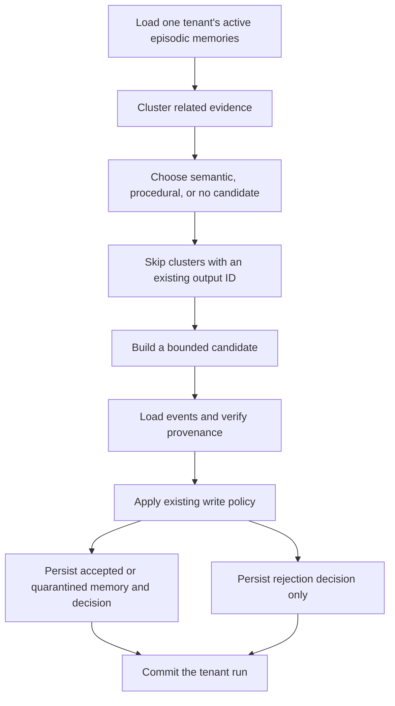

# Persisting consolidation safely

The consolidation service turns eligible episodes from one tenant into compact
long-term memories with inspectable evidence. It connects grouping, promotion,
summary construction, write-policy evaluation, and persistence in one database
transaction. Its output is a list of write-policy decisions for candidates that
reached policy evaluation.

A **UnitOfWork** owns that transaction: either its pending writes commit together,
or a failure rolls them back. A **candidate** is only a proposal. The write
policy decides whether to accept, quarantine, or reject it before the service
creates a stored record.

## Follow one run and its retry

This is an illustrative scenario, not a measured database run. Tenant shop-a
has three active checkout-api pool incidents A, B, and C from September 1, 8,
and 20, 2026. They share subject `service:checkout-api`, category
`connection-pool exhaustion`, and have distinct, valid source events. Assume
they remain valid on September 28 and have sufficiently trusted evidence.
Their remediation outcomes are mixed.

The service groups A, B, and C, chooses a semantic type, and proposes:

```text
service:checkout-api has recurring connection-pool exhaustion (3 episodes).
```

It loads each referenced event in shop-a's scope and runs the write policy.
On acceptance it stores a new active memory S with every event reference and
the episode-to-event mapping. It stores the decision pointing to S, then
commits. A, B, and C retain their original content, provenance, and status.
Their lifecycle metadata links to S and lowers retrieval priority to at most
0.25 through [compaction](forgetting.md).

Run the same job again with the same eligible membership: it computes the same
output ID, finds S, and skips the write. It returns an empty decision list if
nothing else reaches policy. The lookup is by ID, so an existing quarantined,
expired, or tombstoned S also prevents another write for that membership.

| Situation | Durable result |
| --- | --- |
| Two related trusted episodes | One accepted semantic memory, if policy passes |
| Three successful episodes with identical steps and high derived trust | One accepted procedural memory, if policy passes |
| Fifty eligible similar episodes in one cluster | One new memory with all evidence links; 50 originals remain |
| Referenced event missing | Rejection audit entry; no new memory |
| Procedural evidence derives only medium trust | Quarantined memory and decision |
| Only one episode, or low-trust cluster | No candidate and no policy decision |

Consolidation creates a shorter representation, not fewer database records.
Retrieval and [context packing](context-packing.md) still decide which memories
reach a prompt. Compaction lowers source-episode priority, but does not exclude
them or demonstrate a measured reduction in prompt tokens.

## The actual orchestration order

The requested conceptual flow combines proposing a summary with choosing what
it may claim. In this implementation, the type is selected first so the
summarizer can use the correct template:



No-candidate groups and invalid/oversized summary proposals are skipped before
policy. They are not represented by the lower branches of this diagram.
All clusters in the call share one UnitOfWork and one final commit. Accepted
summaries compact their source episodes before that commit.

The repository load already asks for active episodic memories. The service
also filters tenant IDs defensively; the clusterer checks type, status, validity,
and observation dates again. Tombstoned event IDs are excluded before grouping.
Only lifecycle metadata and update timestamps change on compacted episodes.

## Evidence and trust at the write boundary

`verify_provenance` checks each reference against the loaded event's tenant,
source type, source reference, and observation timestamp. It derives trust
from the evidence. `evaluate_write_policy` performs its own provenance check
and then applies safety and memory-type rules. Verifying these fields proves
the references match stored events; it does not prove that the summary or
remediation metadata is entailed by the event's prose.

Accepted and quarantined records copy candidate content, subjects, confidence,
validity, and metadata. Their stored trust is the weaker of verified event
trust and the candidate's proposed trust, which the deterministic summarizer
computed from source records and references. Their status follows the policy
verdict. `uow.create_memory` persists the record and its provenance; the service
then records the decision with `accepted_memory_id` for either persisted status.
Rejected candidates have no accepted memory ID.

To explain S later, retrieve its `metadata.supporting_memory_ids`, inspect
`metadata.episode_event_ids`, and follow its `provenance` event IDs through
same-tenant repository reads. The episode links are metadata rather than
separate relation rows. Originals remain available subject to their normal
lifecycle and access rules.

## What deduplication guarantees

The cluster ID derives from the tenant and sorted member memory IDs. The
candidate ID also includes output type; the stored memory ID derives from the
cluster ID and the fixed string `memory:v1`. This deliberately permits one
stored output per exact cluster membership.

Sequential runs skip that existing output. A tenant transaction lock serializes
cooperating consolidation and lifecycle jobs; the database primary key remains
a final duplicate guard. Database failures propagate to the caller for retry. A later failure in any cluster rolls back the
whole call's pending writes, including earlier clusters' decisions.

This is not global summary deduplication. Adding or removing an eligible member
changes the cluster identity and can create another, overlapping summary.
Existing summaries are not superseded. Explicit tombstoning additionally
blocks reuse of its evidence across changed membership; see
[the evidence scope](forgetting.md#tombstones-and-prevention-of-re-creation). Conversely, changing an existing
member's metadata without changing membership does not refresh an already
stored output. Rejected candidates have no stored output, so repeated runs can
create repeated rejection audit entries. There is no attempt ledger for skips.

## Calling the service and checking behavior

Implementation: [service.py](../apps/memory_service/consolidation/service.py).

`consolidate_memories(uow_factory, tenant_id, *, now=None)` is a Python entry
point, not a newly registered API endpoint or scheduled worker. The following
is an integration sketch, not a standalone executable example:

```python
from apps.memory_service.consolidation.service import consolidate_memories

# Supply the application's configured UnitOfWork factory and a real tenant UUID.
# The database must already contain eligible records and their evidence events.
decisions = consolidate_memories(uow_factory, tenant_id)
```

The supplied factory must open the existing PostgreSQL-backed UnitOfWork, with
the repository schema available. No embedding model or Ollama service is needed.
The metadata contract is described in [clustering](consolidation-clustering.md),
[promotion](consolidation-promotion.md), and [summarization](consolidation-summaries.md).

`now` defaults to current UTC time and controls in-memory eligibility checks
and output creation/update timestamps. It is not a historical replay switch:
the initial repository query uses current active validity independently of that
argument. The candidate's validity comes from its evidence, not the job time.
The service loads the tenant's eligible pool at once; it has no batch-size cap.

For an installed project environment, run from the repository root:

```bash
.venv/bin/pytest tests/unit/consolidation -q
.venv/bin/pytest apps/tests/integration/consolidation -q
```

[Unit service tests](../tests/unit/consolidation/test_service.py) exercise the
real policy with a fake UnitOfWork: evidence retention, repeat-run behavior,
missing evidence, quarantine, rollback, and defensive tenant filtering.
[The persistence test](../apps/tests/integration/consolidation/test_consolidation_persistence.py)
checks the real repositories and requires reachable PostgreSQL with the test
fixtures configured; it skips if the database is unreachable. A skipped test
is not evidence of a successful database round trip.

For the underlying admission rules, see [ingestion](ingestion-flow.md). For
what an agent eventually reads, continue to [retrieval](retrieval-flow.md)
and [context packing](context-packing.md).
