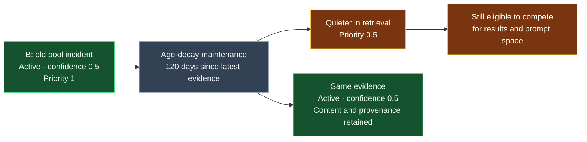
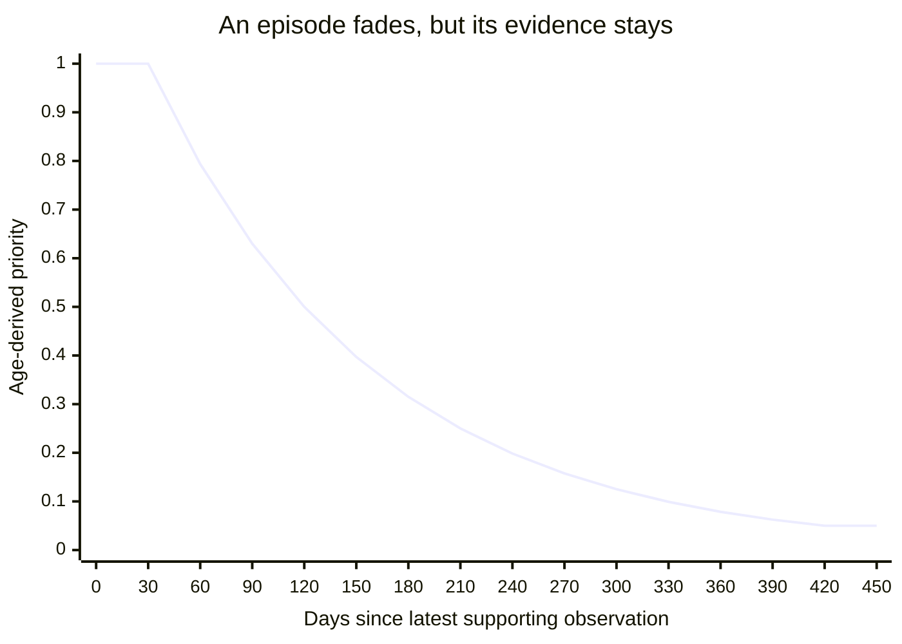
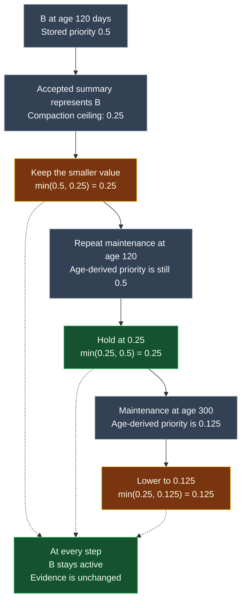

# Forgetting without losing the evidence

Forgetting controls how much stored information influences an agent. Some facts
stop being valid, some old incident reports become less useful, and some records
must stop appearing altogether. These are different decisions. Phase 10 changes
lifecycle state or retrieval priority while preserving content and provenance,
the references back to the original events.

The maintenance job handles expiry, age decay, and compaction. An explicit
removal request creates a tombstone. Neither path hard-deletes evidence.

## Follow four checkout-api memories

The dates, IDs, and confidence values below are illustrative. Assume maintenance
runs on October 2, 2026, at midnight UTC, and all records belong to one tenant.

| Memory | Situation | Result |
| --- | --- | --- |
| A: temporary timeout setting | Active; validity ended October 1 | Becomes `EXPIRED`; normal retrieval excludes it |
| B: old pool incident | Episodic; confidence 0.5; latest supporting event 120 days ago | Priority falls from 1 to 0.5; evidence is unchanged |
| C: recent pool incident | Episodic; confidence 0.9; supports an accepted summary S | Compaction lowers priority to at most 0.25 |
| D: removed incident | A user explicitly requests removal with a reason | Becomes `TOMBSTONE`; normal and historical retrieval exclude it |

A historical query for September 30 can still retrieve A if its validity window
covers that moment. Expiry records that a fact ended, rather than denying that
it was ever true. A tombstone means the record must no longer reach agent
context, including for historical queries. Repository reads for audit still
return the record and its removal details.

B and C remain active. Priority changes how they compete for limited search
results and prompt space; it does not make them ineligible. A sufficiently
relevant old episode can still appear.

Think of B as turning down the volume on an incident report while keeping the
report itself intact. This is the illustrative 120-day outcome above:



## Expiry and historical access

`expire_record` changes an active record to `EXPIRED` only when `valid_to < now`.
An open-ended record does not expire. The equality boundary follows the existing
retrieval convention: at exactly `valid_to`, the record is still valid for
retrieval. The Phase 9 clusterer has a stricter exclusive end boundary, so it
will not consolidate that record at the same instant.

Expiry preserves the validity interval and embeddings so historical retrieval
can still explain the earlier state. Ordinary lexical and vector search already
check validity; an overdue job therefore does not make a past-validity record
retrievable now. Explicit expiry also makes its lifecycle status accurate.

Quarantined and superseded records keep their status. Changing quarantine to
expiry would wrongly permit historical access. Tombstones are terminal.
The first expiry records its time, reason, requester (`policy:expiry`), and
policy version under `metadata.forgetting.expiry`; repeats do not update it.

## How age decay reduces influence

For now, confidence below 0.8 is the explicit proxy for a low-value episode.
This is a policy choice, not a measured definition of usefulness. Semantic and
procedural memories, and episodes at or above 0.8, receive no age penalty.
Compaction can still lower a high-confidence episode's priority because a
summary already represents it.

There is a 30-day grace period, followed by a 90-day half-life. Age is measured
in whole elapsed days since the latest supporting event observation. For B:

The curve below follows an illustrative episode like B, starting at priority 1,
with no newer evidence or compaction. Each plotted point is calculated from the
policy, not a measured retrieval result. The horizontal axis is evidence age,
not the number of maintenance runs.



Read the curve in three parts: a flat 30-day grace period, a halving every
90 days after that, and a floor at 0.05 (first reached at whole-day age 419).
The line connects sampled values; the implementation calculates whole-day age
and only persists a lower priority when maintenance runs. Priority is a ranking
multiplier, not confidence or a probability of retrieval.

At B's 120-day point, the arithmetic is:

```text
age                  = 120 days
age beyond grace     = 120 − 30 = 90 days
priority             = 2 ** (−90 / 90) = 0.5
```

Another 90 days brings the age-derived multiplier to 0.25. It never falls below
0.05. The stored value is the smaller of the previous priority and the newly
calculated value; a repeated job does not multiply it again. Recent/future
observations do not acquire an age penalty. Maintenance skips future-valid
records and processes expiry before decay.

If `p` is the stored multiplier, each ranking stage uses it as follows:

| Stage | Priority adjustment | What remains available |
| --- | --- | --- |
| Lexical search | Order by full-text score × p before the result limit | Returned `rank` remains the raw full-text score |
| Semantic search | Order by cosine distance + (1 − p) before the result limit | Returned `distance` remains raw cosine distance |
| Hybrid fusion | Multiply the combined reciprocal-rank score by p | Per-retriever ranks remain on the hit |
| Built-in CrossEncoder | Sort by raw model score + ln(p) | `rerank_score` remains the raw model score |
| Context packing | Multiply the candidate's base value by p | Content, provenance, and token accounting remain unchanged |

Adding `ln(p)` also lowers negative model scores; multiplying a negative score
by a small number would accidentally improve it. Custom rerankers remain
responsible for their own ordering policy. Hard eligibility checks apply
regardless of the reranker.

These penalties are initial policy settings, not calibrated ranking improvements.
The stored priority also applies to historical searches: `as_of` restores
historical eligibility, not the priority that existed at that date.

## Tombstones and prevention of re-creation

`tombstone_memory` requires a tenant, memory ID, nonempty reason, requester, and
policy identifier. It stores these with the UTC removal time and root memory ID
under `metadata.forgetting.tombstone`. A repeated request preserves the first
audit details and returns no changed IDs.

Removing only S while leaving its supporting episodes available could allow the
same evidence to produce another summary. The implementation therefore uses a
conservative evidence scope: tombstone the requested record and every same-tenant
record connected through shared event IDs, repeatedly until no more records
join. Removing a source can remove its summary; removing a summary can remove
all its sources. This can cover several claims from the same source event.
The function returns every changed memory ID so that scope is inspectable.

No content or provenance is erased. Derived embeddings are cleared, vector
writes reject tombstones, and repository status updates cannot reactivate them.
The generated PostgreSQL lexical index remains a derived representation of
retained audit content; tenant/status predicates ensure it cannot return a
tombstone through the retrieval API. Tests also inject a stale vector artifact
to verify status remains authoritative.

The repository rejects new non-tombstoned records that reuse tombstoned event
IDs. Consolidation excludes those events before grouping, including when a
legacy active copy exists. The denial is based on evidence identity, not a
semantic ban on independently observed future events with similar wording.
There is no external vector store or cache deletion protocol in this version.

Retrieval re-fetches authoritative records before and after reranking and before
context construction. Direct packing and reranking reject tombstone snapshots.
Pure functions cannot discover that a caller's old in-memory snapshot was
subsequently deleted; application callers should use the database-backed pipeline.
A request already handed to a model cannot be recalled by a later deletion.

## Compaction after consolidation

Only an accepted, active semantic/procedural summary with explicit supporting
memory IDs and matching event evidence can compact its source episodes. The
service performs compaction in the same transaction as summary persistence and
the write decision. Rejection or quarantine does not lower source priority.

The episodes remain active, with their content, confidence, validity, and
provenance unchanged. Their metadata gains a summary-ID link and a priority
ceiling of 0.25. If age decay has already lowered an episode further, compaction
does not increase it. Maintenance also compacts eligible summaries created
before this behavior was introduced. Reprocessing the same link does nothing.

Age decay and compaction both turn the same priority dial downward. To see how
they interact, suppose B later supports an accepted summary with matching
evidence. These are illustrative evaluations at the stated ages:



The repeat run neither halves the stored value again nor raises it back to the
age-derived value. Later, age decay can lower it below the compaction ceiling.

This version does not reclaim storage, merge source evidence, or automatically
restore episode priority when a summary later expires. It makes repeated
context less competitive while keeping the evidence inspectable.

## Running maintenance

Implementation: [forgetting.py](../apps/memory_service/consolidation/forgetting.py).
The public transaction entry points are `maintain_memories(uow_factory,
tenant_id, now=...)` and `tombstone_memory(uow_factory, tenant_id, memory_id,
reason=..., requested_by=..., policy=..., now=...)`. Callers supply a configured
UnitOfWork factory and real tenant/memory UUIDs. Pure transition helpers return
a new record or `None` when nothing changes.

With project dependencies installed, PostgreSQL running, and the existing schema
available, run from the repository root. `DATABASE_URL` or the project's `.env`
selects the database. Replace the UUID placeholder with a real tenant ID:

```bash
.venv/bin/python scripts/expire_memories.py --tenant-id <tenant-uuid>
.venv/bin/python scripts/expire_memories.py --all-tenants
```

[The script](../scripts/expire_memories.py) is a one-shot command suitable for
cron or a systemd timer. It prints JSON lists of expired, decayed, and compacted
IDs per tenant. It does not install a schedule or automatically tombstone
records. For a daily deployment schedule, invoke the all-tenant command once
per day using absolute interpreter/script paths and the deployment's environment.

Memory writes, consolidation, and lifecycle jobs share a PostgreSQL transaction
lock per tenant. This orders evidence-denial checks against insertions and
prevents two cooperating jobs from applying the same transition concurrently.
Each tenant commits atomically; a failure rolls back that tenant's pending
changes and the CLI exits unsuccessfully. Tenants committed earlier in an
all-tenant run remain committed. The next run can safely retry them.

There is no new database migration: lifecycle audit and priority use existing
JSON metadata and lifecycle columns. Jobs currently load a tenant's records
and provenance together; batching and an append-only lifecycle history table
remain future work. Decay stores its latest evaluation, while tombstone and
expiry details preserve their first transition.

## Validation and related guides

From the repository root in an installed environment:

```bash
.venv/bin/pytest tests/unit/consolidation/test_forgetting.py
.venv/bin/pytest tests/integration/persistence/test_forgetting.py
```

[Unit tests](../tests/unit/consolidation/test_forgetting.py) cover the boundary,
priority arithmetic, compaction guards, historical eligibility, and direct
reranking/packing exclusions.
[Integration tests](../tests/integration/persistence/test_forgetting.py) use the
disposable PostgreSQL test database with rollback fixtures. They exercise
lexical, semantic, hybrid, reranking and context paths, audit retention,
repeated CLI runs, source/summary deletion, index reconciliation guards, and
transaction rollback. They use deterministic model stand-ins, not ranking
quality benchmarks.

Continue with [consolidation](consolidation-service.md),
[temporal resolution](temporal-resolution.md), or the original
[forgetting decision](adr/005-forgetting-and-deletion.md).
