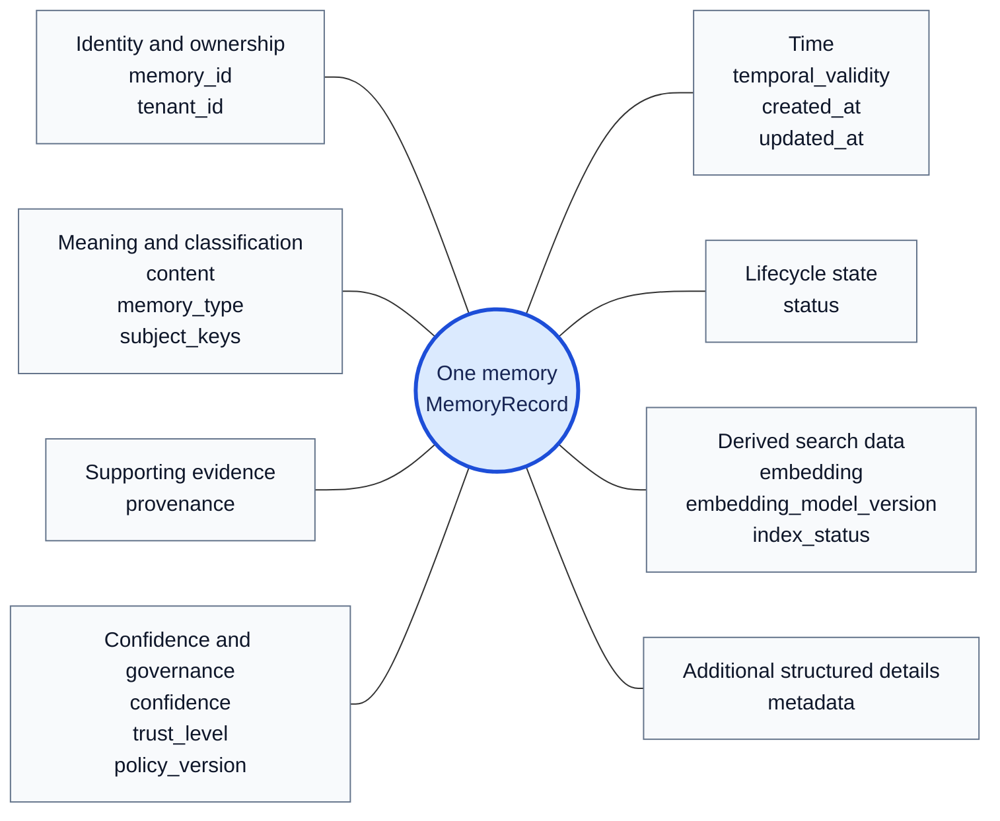
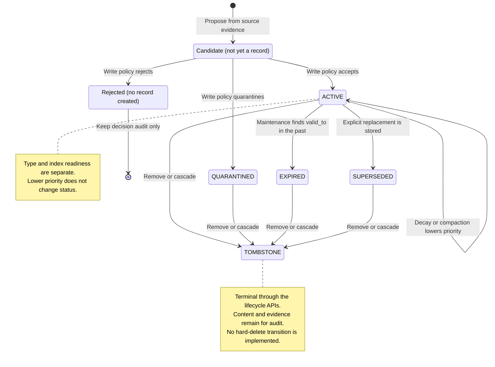

# A memory: its attributes and lifecycle

A memory is a stored note that an agent can use later. The note carries more
than text: it identifies its owner, preserves the evidence behind its claim,
records when it is valid, and controls whether it may appear in an answer.

This guide explains those attributes with a hub-and-spoke diagram, then follows
a memory through a state-machine diagram. The diagrams describe the current
implementation through Phase 10. They use Mermaid; open this Markdown file in
a viewer that supports Mermaid to see the rendered diagrams.

## 1. Start with a concrete note

Suppose a checkout-api incident produced this observation:

> “checkout-api's connection pool was exhausted during the incident.”

The system first stores the source event, then proposes a **candidate**: a
possible memory. A write policy checks its evidence before admitting it as a
stored record. **Provenance** means the references back to those source events.
A **tenant** is the isolated workspace that owns the record.

Here is an illustrative accepted record. Names, dates, identifiers, and numbers
are teaching examples, not measured results or an actual database export.

| Question | Example answer |
| --- | --- |
| Which note is this? | Memory M1, owned by tenant shop-a; real IDs are UUIDs |
| What does it say? | The checkout-api pool was exhausted during an incident |
| What kind of knowledge is it? | `episodic`: something that happened |
| What is it about? | Subject key `service:checkout-api` |
| What supports it? | Event E1, observed September 1, 2026, at 09:00 UTC |
| How certain and trusted is it? | Confidence 0.7; evidence-backed trust `high` |
| When is it valid? | From September 1 at 09:00 UTC, with no configured end |
| May retrieval consider it? | Status `active`, subject to the query's other filters |
| Is meaning-based search ready? | Index status `pending`; no embedding yet |

Confidence is a score between 0 and 1, not a demonstrated probability that the
claim is true. Trust describes the reliability of its evidence. An **embedding**
is a derived list of numbers used to search by meaning. Neither confidence nor
an embedding grants permission to use an otherwise ineligible record.

## 2. Attributes as a hub-and-spoke diagram

The center is one `MemoryRecord`. Each spoke groups related attributes. The
connecting lines mean “has these attributes”; they do not indicate a sequence
or a transition. Every top-level field in the current record model is included.

### What each field means

| Field | Plain-English meaning |
| --- | --- |
| `memory_id` | Unique identifier for this stored note. A replacement or consolidated summary has its own ID. |
| `tenant_id` | Workspace that owns the note; reads and writes are scoped to it. |
| `content` | The nonempty text the memory communicates. |
| `memory_type` | `episodic` for an observation, `semantic` for a fact or general observation, or `procedural` for steps to follow. |
| `subject_keys` | Tags identifying subjects, such as a service or setting; the list may be empty. |
| `provenance` | At least one reference to an event supporting the note. |
| `confidence` | Score from 0 to 1. The initial decay policy uses values below 0.8 as its low-value proxy for episodes. |
| `trust_level` | Evidence trust: `untrusted`, `low`, `medium`, `high`, or `system`. |
| `policy_version` | Version of the write policy used when storing the record. Later forgetting actions record their own policy version in metadata. |
| `temporal_validity` | When the claim applies: `valid_from` and optional `valid_to`. |
| `created_at` | When the stored record was created. This can differ from when its source event happened. |
| `updated_at` | When an operation last recorded an update; lifecycle maintenance updates this when it changes the record. |
| `status` | Current lifecycle state: `active`, `quarantined`, `superseded`, `expired`, or `tombstone`. |
| `embedding` | Optional derived numeric vector for meaning-based search. |
| `embedding_model_version` | Which embedding model produced that vector; absent until supplied. |
| `index_status` | Vector-index readiness: `pending`, `indexed`, or `failed`. |
| `metadata` | Structured details such as clustering keys, summary-source links, priority, and forgetting audit information. |

### What is inside the nested attributes?

Each provenance entry holds `event_id`, `source_type`, `source_reference`,
`observed_at`, `trust_level`, and an optional `excerpt`. The event ID provides a
route back to the source; the other fields allow the reference to be checked.
Checking these fields does not prove that a sentence logically follows from
an event's text.

Temporal validity has two fields. `valid_from` is required. `valid_to=None`
means no configured end, rather than a guarantee that the fact will stay true
forever. An end cannot precede the start.

Metadata contains fields only when the relevant workflow supplies them:

| Metadata location | What it adds |
| --- | --- |
| `incident_key` or `category_key` | A grouping key used with tenant, subjects, and observation times during consolidation |
| `remediation_outcome`, `remediation_steps` | Recorded outcome and ordered steps used to assess procedural promotion |
| `consolidation_version`, `cluster_id` | Which consolidation output this record represents |
| `supporting_memory_ids`, `episode_event_ids` | Links from a summary to its supporting episodes and their source events |
| `forgetting.priority` | Retrieval-priority multiplier; default 1 when absent, bounded between 0.05 and 1 when used |
| `forgetting.decay` | Latest stored decay time and policy |
| `forgetting.compaction` | Compaction time, policy, and IDs of the summaries representing this episode |
| `forgetting.expiry` | First expiry time, reason, requester, and policy |
| `forgetting.tombstone` | First removal time, reason, requester, policy, and root memory ID for the removal request |

The write-decision audit and relations between records are stored separately.
`MemoryRelation` records connections such as supersession or contradiction;
it is not a top-level `MemoryRecord` field. PostgreSQL's generated lexical
`search_vector` is also a separate storage representation, not an attribute
on the domain record shown in the hub.

## 3. Follow the memory over time

Continue with M1 and consider several possible outcomes. These are alternative
paths; every memory does not pass through every state.

- **It remains useful.** M1 stays active. Once its embedding is ready, semantic
  search can find it as well as lexical search.
- **It becomes less important.** As an old, low-confidence episode, M1 can
  receive a lower priority. It stays active, with its original content and
  provenance intact.
- **It contributes to a summary.** Related episodes produce a new accepted
  record S1. M1 stays episodic and active; compaction lowers its priority and
  links it to S1. It does not turn into S1.
- **Its configured validity ends.** If M1 had a finite validity end, maintenance
  would mark it expired after that end passes. Its open-ended example above
  does not expire automatically just because it grows old.
- **A new claim replaces it.** An explicit supersession operation stores a
  separate replacement, closes the old record's validity, and marks the old
  record superseded. For example, a new timeout setting can replace an old one.
- **Someone requests removal.** Tombstoning blocks the record from agent
  retrieval, including historical retrieval, and records the removal details.

An uncertain candidate can instead enter quarantine at admission. A rejected
candidate creates a write-decision audit entry but no stored memory record.

## 4. Lifecycle as a state-machine diagram

The diagram shows the admission outcomes and the transitions performed by the
normal lifecycle services. `Candidate` and `Rejected` are explanatory steps;
only the five uppercase states are values of `MemoryRecord.status`.

There is no transition from tombstone back to active, and no final deletion
marker after tombstone: the row remains for audit. The final marker after
`Rejected` ends a proposal's processing; it does not erase a stored record.

The low-level repository has a general status-update method for non-tombstoned
records. It can set statuses beyond the normal paths shown here, so this diagram
is not an exhaustive database constraint. There is no automated quarantine
review/release service or expired-memory reactivation workflow. Tombstone
reactivation is explicitly blocked.

### What each state permits

“Eligible” below means a record can be considered, not that it must be returned.
Tenant, trust, type, validity, recorded conflicts, and ranking still matter.
Historical retrieval is a query with an explicit `as_of` timestamp.

| Stored status | Ordinary retrieval | Historical retrieval | Audit repository read |
| --- | --- | --- | --- |
| `ACTIVE` | Eligible when currently valid | Eligible when valid at the requested time | Available |
| `QUARANTINED` | Excluded | Excluded | Available |
| `SUPERSEDED` | Excluded | Eligible when it applied, subject to replacement/conflict resolution | Available |
| `EXPIRED` | Excluded | Eligible inside its earlier validity window | Available |
| `TOMBSTONE` | Excluded | Excluded | Available; removal details retained |

The current retrieval validity check includes `valid_to` itself; maintenance
expires only when `valid_to < now`. The consolidation clusterer uses an
exclusive end boundary, so it stops considering the record at `valid_to`.
Ordinary retrieval also checks dates before the expiry job runs, preventing a
past-validity record from appearing merely because its status is still active.

## 5. Keep these independent properties separate

| Property | Question answered | Example change |
| --- | --- | --- |
| Memory type | What kind of knowledge is this? | Consolidation creates a new semantic or procedural record from episodes |
| Lifecycle status | Is this record usable now, historical, held back, or removed? | `ACTIVE` → `EXPIRED` |
| Validity window | At what time does the claim apply? | A replacement closes the old record's `valid_to` |
| Retrieval priority | How strongly should an eligible record compete for attention? | Compaction caps an episode's priority at 0.25 |
| Index status | Is the derived vector ready for semantic search? | `PENDING` → `INDEXED` after embedding succeeds |

An active record with a pending or failed embedding can still appear in lexical
search. An indexed tombstone is still excluded: index readiness never overrides
lifecycle status. Tombstoning clears the embedding and sets index status to
pending, but this does not authorize reindexing; vector writes reject it.

Removal also follows shared evidence within the same tenant. Tombstoning a
summary can tombstone its sources, and tombstoning a source can tombstone its
summaries and other records connected through event IDs. New records cannot
reuse that tombstoned evidence. This conservative scope prevents old evidence
from bringing removed content back through consolidation; it is not a ban on
all independently observed future claims with similar wording.

## 6. Implementation and further reading

The diagrams and examples are explanations of the implementation, not outputs
of a model or measurements of retrieval quality. No database or model service
is needed to read this guide.

| Component | Source or tests |
| --- | --- |
| Record, provenance, temporal validity, relation, and decision fields | [Domain models](../apps/memory_service/domain/models.py) |
| Memory types, lifecycle states, trust levels, and index states | [Enums](../apps/memory_service/domain/enums.py) |
| Admission and decision persistence | [Ingestion service](../apps/memory_service/ingestion/service.py) |
| Explicit replacement of an old record | [UnitOfWork.supersede_memory](../apps/memory_service/persistence/unit_of_work.py) |
| Expiry, decay, compaction, and audited removal | [Forgetting implementation](../apps/memory_service/consolidation/forgetting.py) |
| Normal versus historical eligibility | [Retrieval filters](../apps/memory_service/retrieval/filters.py) |
| Temporal, decay, compaction, and tombstone behavior | [Unit tests](../tests/unit/consolidation/test_forgetting.py) and [PostgreSQL integration tests](../tests/integration/persistence/test_forgetting.py) |

For a full walkthrough of each stage, read [ingestion](ingestion-flow.md),
[consolidation](consolidation-service.md), [forgetting](forgetting.md), and
[temporal resolution](temporal-resolution.md).
