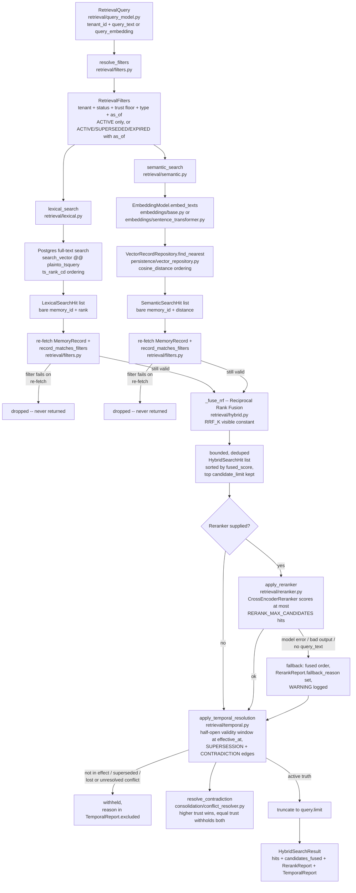

# Retrieval pipeline

**Retrieval finds stored memories that can help answer a question, puts them
in a useful order, and removes memories that the query must not use.** The
result is a list of supporting notes, not a generated answer.

Start with the checkout example below. Then follow the calculations and
code reference if you want to understand or change the implementation.

## 1. Why use more than one kind of search?

Imagine an on-call engineer asks:

> “checkout-api timeout: what should I check?”

One useful memory contains the exact service name and the word “timeout.”
Another says that requests stalled when the gateway connection pool filled
up. Both could help, even though their words differ.

The system combines two search methods:

- **Lexical search** matches words in the question to words in stored notes.
  It is useful for names and error codes. Here it uses PostgreSQL full-text
  search, which processes words rather than doing a literal Ctrl+F search.
- **Semantic search** looks for related meaning. It represents text as a
  list of numbers, called an **embedding**, and compares those lists. It can
  find paraphrases, but similar wording can also hide opposite meanings.

Using both is called **hybrid search**. Each returns an ordered list of
**candidates**: memories that might be useful. A candidate's **rank** is its
position in a list, starting at 1.

```text
Stored memories → word search + meaning search → combine → optional reranking
                → check time and conflicts → return a limited list
```

## 2. Walk through a realistic example

Assume these notes belong to the same tenant (the account or organization
whose data is being searched), pass the requested trust and type filters,
and are valid at the requested time:

| Note | Stored content | Why it might help |
| --- | --- | --- |
| A | The checkout-api request timeout is 2 seconds. | Gives the current setting |
| B | Checkout requests stalled when the payments-gateway connection pool filled up. | Describes a related incident |
| C | For checkout-api timeout errors, inspect gateway pool saturation. | Suggests a check |

### Step A: search in two ways

Suppose the searches produce the following ranks. These ranks are
illustrative inputs for the arithmetic, not measured model output:

| Note | Word-search rank | Meaning-search rank |
| --- | ---: | ---: |
| A | 1 | 3 |
| B | Not returned | 1 |
| C | 2 | 2 |

B still has a chance to appear because the meaning search found it. A and
C appear in both lists, but the merged result will contain each memory only
once, identified by its memory ID.

### Step B: combine the rankings

The search methods produce different kinds of scores, so the system combines
**positions** instead. This method is called **Reciprocal Rank Fusion (RRF)**.
Each search that found a memory contributes `1 / (60 + rank)`; a search that
did not find it contributes nothing. The constant 60 is `RRF_K` in the code.

| Note | Calculation | Combined score |
| --- | --- | ---: |
| A | `1/61 + 1/63` | 0.03227 |
| B | `1/61` | 0.01639 |
| C | `1/62 + 1/62` | 0.03226 |

The combined order is **A, C, B**. These scores are ordering weights, not
probabilities that a memory answers the question correctly. Finding a memory
in both searches helps, but does not guarantee it wins every comparison.

### Step C: optionally read each candidate more closely

A **reranker** scores the question together with each shortlisted note.
It might move C first because the question asks what to check, rather than
what the timeout setting is. That is an illustrative possible outcome;
the exact order depends on the model. See [Reranking](reranking.md) for a
worked before-and-after example.

### Step D: check dates and recorded disagreements

A strong search match is not enough to use an outdated fact. The system
checks validity dates, recorded replacements, and recorded contradictions
after ranking. A “5 seconds” note replaced by A must not win merely because
its wording matches better. See [Temporal resolution](temporal-resolution.md).

### Step E: return the requested number of memories

If `limit=2`, the system returns at most two surviving candidates, in rank
order. It can return fewer if candidates were excluded. The report explains
reranking and temporal exclusions; it does not generate the agent's answer.

For a prompt constrained by tokens instead of a result count,
[context packing](context-packing.md) chooses a useful subset of these
resolved memories and formats it for the agent.

## 3. What each stage is responsible for

| Stage | Question it answers |
| --- | --- |
| Filters and revalidation | Does this memory belong to this tenant and meet the query's status, time, trust, and type rules? |
| Word and meaning search | Which eligible memories might match? |
| Fusion | How should the two rankings be combined? |
| Optional reranking | Which shortlisted notes best address this exact question? |
| Temporal resolution | Which candidates remain usable given dates and recorded conflicts? |
| Result limit | How many surviving notes should the caller receive? |
| Context packing, when requested | Which notes are worth the available prompt space? |

Both search methods re-fetch and re-check their matches **before fusion**.
The temporal stage later checks relationships between memories. Neither a
high search score nor a high reranker score can override those checks.

## 4. Technical reference

Paths in the stage table below are relative to `apps/memory_service/`.

### Detailed flowchart (with code references)



### Modules and responsibilities

| Stage | Module | Notes |
| --- | --- | --- |
| Query | `retrieval/query_model.py` (`RetrievalQuery`) | Requires exactly one of `query_text` / `query_embedding`. Carries `tenant_id`, optional `memory_types`, `min_trust`, `as_of`, and `limit`. |
| Filters | `retrieval/filters.py` (`resolve_filters`) | Pure, deterministic -- no DB, no model. `allowed_statuses` is `{ACTIVE}` for an ordinary query; a query with `as_of` gets `HISTORICAL_STATUSES` (`ACTIVE`, `SUPERSEDED`, `EXPIRED`) so a fact that has since been replaced can still be found for a time when it was true -- its validity window decides. `QUARANTINED` and `TOMBSTONE` are never allowed. This is the same module both retrievers and the fusion step depend on. |
| Lexical search | `retrieval/lexical.py` (`lexical_search`) | PostgreSQL full-text search over the `search_vector` generated column (content + subject_keys). Good for exact terms, IDs, error codes; blind to synonyms. Returns `[]` if only `query_embedding` was given. |
| Semantic search | `retrieval/semantic.py` (`semantic_search`) | Embeds the query (via whichever `EmbeddingModel` is passed in) and runs exact pgvector cosine-distance search through `persistence/vector_repository.py` (`VectorRecordRepository.find_nearest`). Good for paraphrases; can be fooled by near-identical phrasing that differs only in meaning (e.g. negation). |
| Revalidation | `retrieval/filters.py` (`record_matches_filters`) | Both retrievers re-fetch the full `MemoryRecord` for every match and re-check the hard filters against it, independently of what the search query already filtered on (ADR-004: revalidate before use). |
| Fusion | `retrieval/hybrid.py` (`hybrid_search`, `_fuse_rrf`) | Reciprocal Rank Fusion: each memory's score is the sum of `1 / (RRF_K + rank)` across every retriever that returned it. A memory found by both retrievers is scored once, from both contributions -- see `_fuse_rrf`'s docstring for the exact mechanics and a documented edge case (a rank-1 hit can still lose to a hit that's merely "pretty good" on both signals). |
| Candidate pool | `retrieval/hybrid.py` (`hybrid_search_with_report`) | With a reranker, each retriever is asked for `max(query.limit, reranker.max_candidates)` results (or an explicit `candidate_limit`), the fused list is cut to that many, and only after reranking and temporal resolution is it truncated to `query.limit`. Without one, the pool defaults to `query.limit`; an explicit `candidate_limit` can widen it. |
| Reranking | `retrieval/reranker.py` (`CrossEncoderReranker`, `apply_reranker`); model in `embeddings/cross_encoder.py` | A CrossEncoder (`cross-encoder/ms-marco-MiniLM-L-6-v2` by default) reads the query and each candidate *together* and reorders them. Bounded twice: `apply_reranker` only hands the reranker `max_candidates` hits (`RERANK_MAX_CANDIDATES = 30`), and `CrossEncoderReranker` only scores that many. Any failure -- model error, output that is not an exact reordering of its input, or an embedding-only query -- returns the fused order with `RerankReport.fallback_reason` set and a WARNING logged. See `docs/reranking.md`. |
| Temporal / conflict resolution | `retrieval/temporal.py` (`apply_temporal_resolution`, `select_in_effect`); `consolidation/conflict_resolver.py` (`resolve_contradiction`, `record_contradiction`) | Runs after reranking over the whole candidate pool, before truncation, and never looks at a score. Removes a candidate that is (a) not eligible (tenant/status/trust/type), (b) not in effect at `effective_at` -- windows are half-open, `valid_from <= t < valid_to`, so back-to-back supersession windows never both apply, (c) the target of a `SUPERSESSION` edge whose newer side is in effect, or (d) in a `CONTRADICTION` with another in-effect, non-superseded memory: strictly higher trust wins, equal trust withholds both. The other side of an edge is fetched from PostgreSQL even if retrieval didn't return it. Every removal (with its reason) and every contradiction considered is recorded on `HybridSearchResult.temporal`; unresolved conflicts are withheld from `hits` but surfaced there. See `docs/temporal-resolution.md`. |
| Context packing | `retrieval/context_packer.py` (`retrieve_context`, `pack_context`) | Runs on the resolved hits, for an agent prompt rather than a ranked list. Re-checks the hard filters, removes near-duplicates (content-term Jaccard >= 0.8), then uses two greedy passes to choose a valuable set within `token_budget`: value comes from rank and type (semantic/procedural over episodic), and a memory overlapping a picked one by more than 0.5 -- subject keys, discounted across types -- is never added. Renders one line per memory with type, trust, validity, and a short ref; the whole text is measured and never exceeds the budget according to the configured token counter. See `docs/context-packing.md`. |

The key rules: **ranking never overrides authorization**, and
**ranking never overrides truth.**
`resolve_filters`/`record_matches_filters` decide what is even eligible to be
a candidate; lexical rank, cosine distance, the fused RRF score, and the
CrossEncoder score only ever decide *order* among candidates that already
passed those filters. `apply_reranker` enforces this for reranking by
rejecting any reranker output that adds, drops, or duplicates a hit.
Likewise `retrieval/temporal.py` decides which of the ranked candidates are
usable at the requested time from validity windows, supersession, and trust
alone, so an old or contested fact cannot win by matching the query better.

## Reranking: measured quality and cost

Read the metrics as follows: **Recall@5** is the share of relevant memories
found in the top five; **MRR** averages the reciprocal rank of the first
relevant result (rank 1 contributes 1, rank 2 contributes 0.5); **nDCG@5**
measures how close the top-five order is to an ideal relevance order.
Higher is better for all three. **P50** is the median latency; **P95** is the
latency at the 95th percentile. Lower latency is faster.

`uv run python -m apps.benchmark.run_retrieval_eval` compares hybrid
retrieval with and without the CrossEncoder over the *same* 30-candidate
fused pool (so the reranker is the only difference), on a labeled set of
24 memories and 16 queries with deliberate near-miss distractors. These are
previously recorded results from a development machine, not a fresh run.
Timings vary by hardware; quality depends on the fixed dataset and models:

| strategy | Recall@5 | MRR | nDCG@5 | P50 ms | P95 ms | rerank P50 / P95 ms | candidates reranked |
| --- | --- | --- | --- | --- | --- | --- | --- |
| hybrid (RRF) | 1.000 | 0.906 | 0.952 | 44.3 | 55.3 | - | 0 |
| hybrid + CrossEncoder | 1.000 | 0.938 | 0.964 | 52.4 | 57.9 | 7.8 / 9.6 | 24 (whole pool; cap 30) |

The reranker moved two answers from rank 2 to rank 1 (a negation query --
"is dark mode turned off" -- and an intent query, "how should we contact the
user") and moved one from rank 1 to rank 2 ("how do we avoid expired
certificates", where it preferred the incident whose root cause was an
expired certificate). Net: better MRR/nDCG for about 8 ms per query at 24
candidates. Recall@5 is saturated on a corpus this small; a larger dataset is
needed before tuning `RERANK_MAX_CANDIDATES`.

## Trying it

### HTTP example

Start PostgreSQL, apply migrations, and start the API as shown in
[Ingestion](ingestion-flow.md#running-it-via-curl). Use a registered tenant
with accepted memories. Newly ingested memories need indexing before the
meaning search can find them:

```bash
curl -s -X POST "http://localhost:8000/tenants/$TENANT_ID/memories/index"

curl -s -X POST "http://localhost:8000/tenants/$TENANT_ID/retrieve" \
  -H "Content-Type: application/json" \
  -d '{"query_text":"checkout-api timeout: what should I check?","limit":5,"rerank":true}'
```

`TENANT_ID` is the value obtained during the ingestion walkthrough. The
response contains `hits` and a `pipeline` report. The first call can be
slower because it loads local models. `POST /tenants/{tenant_id}/context`
provides the packed prompt version.

### Python example

The following snippets assume `my_tenant_id` is the UUID of an existing
tenant with indexed memories, and PostgreSQL is running with migrations
applied. The Python API leaves reranking off unless you pass a reranker;
the HTTP retrieval endpoint defaults `rerank` to `true`.

```python
from apps.memory_service.embeddings.sentence_transformer import SentenceTransformerEmbeddingModel
from apps.memory_service.persistence.unit_of_work import UnitOfWork, build_engine, build_session_factory
from apps.memory_service.retrieval.hybrid import hybrid_search
from apps.memory_service.retrieval.query_model import RetrievalQuery

embedder = SentenceTransformerEmbeddingModel()
session_factory = build_session_factory(build_engine())

def uow_factory():
    return UnitOfWork(session_factory)

query = RetrievalQuery(tenant_id=my_tenant_id, query_text="pool exhaustion", limit=5)
with uow_factory() as uow:
    hits = hybrid_search(uow, embedder, query)

for hit in hits:
    print(hit.fused_score, hit.memory.content)
```

With reranking (load the CrossEncoder once and reuse it):

```python
from apps.memory_service.embeddings.cross_encoder import SentenceTransformerCrossEncoder
from apps.memory_service.retrieval.hybrid import hybrid_search_with_report
from apps.memory_service.retrieval.reranker import CrossEncoderReranker

reranker = CrossEncoderReranker(SentenceTransformerCrossEncoder(), max_candidates=30)
with uow_factory() as uow:
    result = hybrid_search_with_report(uow, embedder, query, reranker=reranker)

print(result.rerank)  # candidates_reranked, latency_ms, fallback_reason
for hit in result.hits:
    print(hit.rerank_score, hit.fused_score, hit.memory.content)
```

For experiments without an embedding-model download,
swap in `apps.memory_service.embeddings.base.FakeEmbeddingModel` -- the same
one used in relevant tests. The pipeline still requires PostgreSQL; the fake
model does not reproduce real semantic relevance.

## Limitations and tests

Retrieval can only rank memories present in its bounded candidate pool. It
has no absolute relevance threshold, so an off-topic question can still
return the best available matches. Reranking can make mistakes; temporal
resolution checks recorded dates and relationships rather than discovering
truth from text. Small benchmark gains are not guarantees for other data.

The tests exercise the individual stages and the combined pipeline:

- `apps/tests/integration/retrieval/test_lexical_search.py` -- lexical search
  alone: exact matches, tenant isolation, status/time filtering.
- `apps/tests/integration/retrieval/test_semantic_search.py` and
  `test_exact_search_quality.py` -- semantic search alone, plus the
  Recall@K/MRR labeled-dataset evaluation (ADR-003's stop condition before
  any ANN index).
- `apps/tests/integration/retrieval/test_hybrid_search.py` -- the three
  demonstrations that motivate hybrid search: a query where lexical wins
  (exact term), one where semantic wins (paraphrase), one where semantic is
  actually *wrong* (negation confusion) and hybrid recovers, and the
  aggregate MRR comparison across all of them (lexical 0.6, semantic 0.9,
  hybrid 1.0).
- `apps/tests/integration/retrieval/test_reranking.py` -- reranking moves
  the known answer to rank 1, improves MRR/nDCG on the labeled dataset, never
  scores more than the configured cap, never *sees* a memory excluded by the
  tenant/trust/status/time filters, and falls back to the hybrid order (with
  a recorded reason) when the model fails.
- `apps/tests/integration/retrieval/test_temporal_resolution.py` -- ADR-004
  end to end: old vs. newer timeout (February returns 5s; March 1, April,
  and "now" return 2s; never both), old vs. newer address, expired /
  tombstoned / quarantined exclusion, unresolved contradictions withheld
  and surfaced (even when the query never retrieved the other side),
  higher trust winning a contradiction, and tenant isolation. Each checks
  that a stale fact loses despite scoring better.

For design decisions, see [Architecture](../ARCHITECTURE.md),
[ADR-003: hybrid retrieval](adr/003-hybrid-retrieval.md), and
[ADR-004: temporal conflicts](adr/004-temporal-conflict-semantics.md).
