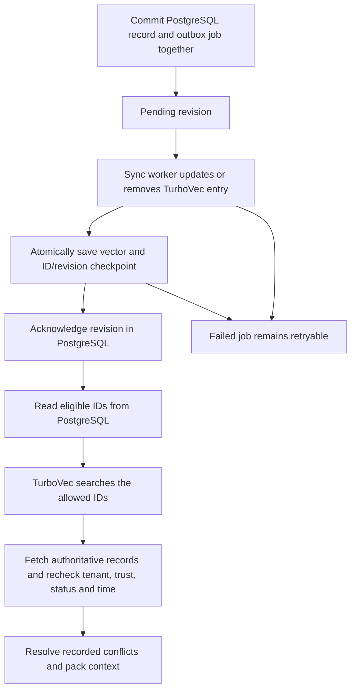

# Phase 6B: comparing vector backends

A vector index finds memories with similar meaning to a question. PostgreSQL
already stores the full embedding vectors and can search them exactly, or use
an HNSW graph to search approximately. TurboVec offers another possibility:
keep a compressed index in a separate local file and process.

The experiment asks whether that extra index makes the local workload fast
or small enough to justify keeping two systems consistent. The first
[measured report](reports/vector-backend-comparison.md) and its
[JSON traces](reports/vector-backend-comparison.json) record the comparison.
The normal service continues to use its existing pgvector retrieval path.

The final pilot measured 7,802 chunks and 55 scored queries, with five
repetitions in each filtering condition. Gold Recall@10 was 0.3898 for all
three backends. Complete retrieval P50 was 29.01 ms for exact pgvector,
22.60 ms for HNSW and 31.47 ms for TurboVec. The local decision is to retain
PostgreSQL retrieval and consider HNSW for latency. The compressed index
remains useful to investigate at larger scales or under memory pressure,
but this pilot does not justify enabling the second index in the normal API.

## Start with one changing memory

Consider an illustrative checkout-api setting: “The request timeout is
2 seconds.” Its PostgreSQL record includes a tenant, evidence, trust,
status and a validity period. Its **embedding** is a list of numbers that
represents the text for similarity search. A returned ID is a **candidate**,
not permission to show the record to an agent.

The following is an illustrative lifecycle, not a performance measurement:

| Event | PostgreSQL record | External sync state | What a read can return |
| --- | --- | --- | --- |
| Record and embedding commit | Accepted and durable | `pending` | pgvector can find it; TurboVec waits for sync |
| Worker fails to update TurboVec | Still accepted | `failed` | No external candidate from the failed revision |
| Worker retries and saves a checkpoint | Still accepted | `indexed` at the current revision | Candidate ID, followed by PostgreSQL revalidation |
| User forgets the record | Tombstoned and durable | `pending` removal | Neither current nor historical retrieval can show it |
| Reconciliation finds the stale vector | Still tombstoned | Eventually `absent` | Vector removed; the tombstone remains authoritative |

An **external revision** counts relevant changes to a PostgreSQL record.
The worker records which revision its durable checkpoint contains. A stale
checkpoint cannot serve a newer acknowledged revision. The external sync
state is separate from the existing `memory_records.index_status`, which
tracks whether the PostgreSQL embedding is ready.



PostgreSQL is authoritative throughout. A TurboVec file contains compressed
vectors and an ID/revision manifest; it supplies neither authoritative text
nor authorization. Trust scores and similarity scores cannot override tenant
or lifecycle constraints.

## What is actually compared

The independent profile is
[vector_backend_comparison.json](../apps/benchmark/datasets/configs/vector_backend_comparison.json).
It selects the same first RULER QA1, RULER QA2 and LongMemEval contexts used
by the initial retrieval pilot, with deterministic sampling of twenty
questions per context before label eligibility is checked. It retains every
context chunk, including distractors. Questions, answers and relevance
labels are never indexed.

The normalized Hugging Face corpus is produced by the existing
[MemoryAgentBench adapter](memory-agent-bench.md), using `huggingface_hub`
and `datasets`. This experiment verifies the prepared corpus against its
manifest and computes document and question embeddings once. Each backend
receives the same cached float32 vectors. The cache records input and file
hashes; the report records its hash and the implementation hash.

| Backend | Search | State retained |
| --- | --- | --- |
| pgvector exact | Full cosine-distance scan over eligible records | PostgreSQL records and embeddings |
| pgvector HNSW | Approximate cosine graph search, with strict iterative filtering | PostgreSQL plus a graph index |
| TurboVec | Uncalibrated 4-bit quantized flat scan with an explicit allowlist | PostgreSQL plus outbox and checkpoint |

The opt-in adapters compare pure cosine ranking. The existing default
`VectorRecordRepository` also applies a lifecycle priority penalty; this
comparison does not replace that behavior. It measures retrieval and
revalidation separately from reasoning, reranking and prompt selection.

All searches enforce tenant, allowed status, validity and embedding readiness.
The additional filtered workload requires HIGH-or-higher trust and EPISODIC
type. For reproducible selectivity, the runner assigns HIGH trust to every
fifth chunk and SEMANTIC type to every fourth chunk. These are benchmark
attributes, not claims about the source data's trust or memory type.

## Understand quality before speed

There are two useful definitions of recall here:

- **Gold Recall@10:** how much dataset-labeled evidence was found in ten
  results. This tests the embedding and retrieval combination.
- **ANN Recall@10:** how many of exact pgvector's top ten eligible IDs the
  approximate backend returned. This isolates approximation error.

Illustrative arithmetic: suppose a question has two labeled evidence chunks,
and ten returned candidates contain one of them at rank two. Gold recall is
`1 / 2 = 0.5`, precision is `1 / 10 = 0.1`, reciprocal rank is `1 / 2 = 0.5`,
and binary nDCG is approximately `0.387`. If nine of those candidates also
occur in the exact top ten, ANN recall is `9 / 10 = 0.9`. Good agreement with
exact search can coexist with weak evidence retrieval.

MRR@10 averages reciprocal rank across questions. nDCG@10 discounts relevant
results by `log2(rank + 1)` and divides by the ideal ordering. RULER's
answer-span labels are proxies; LongMemEval's provided evidence-turn labels
are inherited by chunks. Interpret the source-specific rows as well as the
combined diagnostic. The filtered workload reports agreement with a filtered
exact reference; it omits gold scores because filtering changes eligibility.

P50 latency is the median; P95 shows the slower tail. Measured requests
include database authorization, backend configuration, record/provenance
fetches and revalidation. They exclude embedding and packing. Backends run
in seeded, interleaved order, with untimed warmups and repeated queries.
The report also shows TurboVec's native kernel with a cached allowlist;
that faster inner operation cannot stand in for a complete retrieval.

## Synchronization and recovery

[Migration 006](../migrations/versions/006_create_vector_index_outbox.py) adds
the separate outbox and a database trigger. Inserts, relevant updates and
deletions enqueue work in the same PostgreSQL transaction. The outbox has no
record foreign key so a hard deletion can leave a durable removal job.
Existing records are backfilled. PostgreSQL assigns stable numeric vector
IDs; UUIDs are never truncated or hashed into a collision-prone ID space.

The [worker](../apps/memory_service/indexing/sync_worker.py) selects bounded
batches with row locks and `SKIP LOCKED`. It reads the committed record,
upserts eligible embeddings, and removes tombstones, quarantines, deleted
records or records without a ready embedding. Superseded and expired
embeddings remain available for historical reads, subject to PostgreSQL's
query filters. A vector normalization check rejects zero, malformed and
nonfinite vectors.

The checkpoint combines TurboVec bytes with the UUID/revision/vector-hash
manifest in one file. Saving flushes and fsyncs a temporary file, atomically
renames it, and fsyncs its directory. Only then does the worker acknowledge
the revision in PostgreSQL. A process crash or PostgreSQL acknowledgement
failure can cause replay; upsert and removal are idempotent. An external
write or checkpoint failure records a retryable failure without undoing the
already committed memory.

[Reconciliation](../apps/memory_service/indexing/reconciliation.py) audits
the whole inventory against authoritative records, backfills missing jobs,
and detects missing IDs, ghosts, stale revisions and vector-hash differences.
It requeues repairs and drains them in bounded batches. A persistent failure
returns a failure count; it does not retry forever. This initial full audit
is O(N) in record count and loads record embeddings into memory. It is a
baseline for measuring operational cost, not a streaming large-scale repair
service.

One process owns a checkpoint for its lifetime using an exclusive file lock.
Its worker and reader share the same `TurboVecIndex` instance, protected by
a thread lock. A standalone worker and another reader cannot concurrently
open the same checkpoint. This experiment introduces neither a network
TurboVec server nor a multi-process serving protocol. The existing API and
hybrid retrieval remain on their default PostgreSQL path; the opt-in
[backend context entry point](../apps/memory_service/retrieval/vector_backend.py)
performs authoritative revalidation, temporal resolution and context packing.
Use one active checkpoint per migrated PostgreSQL schema: the sync state
tracks one TurboVec backend, not independent acknowledgements for multiple
index replicas. A missing checkpoint requires a reconciliation pass before
it can serve the already acknowledged corpus.

## Run the comparison

Use the already running PostgreSQL instance configured by `.env`. It needs
pgvector installed and permission to create an isolated schema. Do not run
this against a database account that lacks those permissions. Install the
optional bindings and prepare the Hugging Face corpus as described in the
dataset guide:

```bash
uv sync --extra benchmark --extra vector-benchmark

# If the corpus has not yet been prepared:
uv run --extra benchmark python -m apps.benchmark.datasets.memory_agent_bench \
  --config apps/benchmark/datasets/configs/memory_agent_bench.json \
  --output-dir data/benchmarks/memory_agent_bench

# With the existing normalized corpus and cached MiniLM model:
HF_HUB_OFFLINE=1 .venv/bin/python -m apps.benchmark.run_vector_backend_benchmark \
  --postgres-container project-3-long-term-agent-memory-postgres-1
```

The default output is `docs/reports/vector-backend-comparison.json` and a
matching Markdown file. Supply `--output` for a new report, `--profile` for a
different independent selection, `--repeats` to change repetitions, and
`--bits 2`, `3` or `4` for a quantization comparison. `--prepare-only` writes
the shared embedding cache without accessing PostgreSQL. Omit
`--postgres-container` when Docker memory counters are unavailable; the
report explicitly records their absence.

Every invocation uses fresh, explicitly qualified `vector_bench_<uuid>`
schemas and real commits, then drops only those schemas in `finally`.
This allows committed-write failure tests without altering the user's
records or installed public-schema indexes. An interrupted process that
cannot execute cleanup may leave a schema for manual inspection. Index
checkpoints use unique names under ignored `data/benchmarks/vector_backends/`.
The benchmark does not migrate the public service schema.

To opt into a persistent deployment experiment, apply the normal migration
sequence to the intended development database, then use a checkpoint outside
the benchmark's temporary corpus. These commands change that configured
database and start a single-owner worker:

```bash
uv run alembic upgrade head
.venv/bin/python -m apps.memory_service.indexing.sync_worker \
  --index data/vector-index/development.zip --watch

# Stop that owner before opening the checkpoint in another command:
.venv/bin/python -m apps.memory_service.indexing.sync_worker \
  --index data/vector-index/development.zip --reconcile
```

Applying the migration does not switch the API's retrieval backend. Use the
opt-in Python entry point in an owner process to evaluate serving integration.

## Interpret resource and recovery costs honestly

The report measures PostgreSQL ingest with evidence, provenance, vectors and
outbox writes, HNSW build time, committed embedding updates, and TurboVec
sync/checkpoint throughput. HNSW's bulk-build figure amortizes ingest and
offline build; it does not measure incremental inserts into a populated
graph. The first TurboVec total-update measurement retains the existing
HNSW graph, so its timing includes graph maintenance too.

Index size is reported alongside the authoritative PostgreSQL heap/TOAST,
outbox and raw vector payload. Adding a compressed file does not reduce the
PostgreSQL bytes retained by this implementation. TurboVec's small-corpus
size includes a fixed rotation/codebook cost and the UUID/revision manifest.

RAM counters have different scopes. A fresh TurboVec subprocess reports RSS
before and after load, preparation and first search. PostgreSQL reports
backend allocator contexts and, when supplied, whole-container memory.
Shared buffers and unrelated sessions prevent attributing container memory
to one index. These are measured counters with limits, not a fair isolated
per-index RAM compression ratio.

TurboVec restart includes deserialization and first native search, plus a
separate fresh-process wall time. PostgreSQL reader restart means reconnecting
and issuing a first revalidated query. The benchmark leaves the existing
server running; it does not claim a server restart or crash-recovery result.
Filesystem caches remain warm. A dedicated disposable PostgreSQL server is
needed for an equivalent cold-server recovery experiment.

Reconciliation time includes an injected missing/ghost repair and a clean
full audit. The measured repair uses actual index entries, not simulated
timings. The [integration tests](../apps/tests/integration/retrieval/test_vector_backends.py)
exercise committed-write failure, stale tombstones, tenant/trust/status/time
checks, idempotent retries and checkpoint recovery. The
[unit tests](../apps/tests/unit/benchmark/test_vector_backends.py) cover vector
validation, stable IDs, checkpoint round trips and single-owner enforcement.

The stop condition is a workload decision supported by the report: compare
complete request latency and filtered latency, approximation loss, retained
storage, update throughput and measured repair cost. Keep pgvector as the
default when the pilot does not show enough benefit to pay for those costs.
Repeat at larger corpus sizes before extrapolating capacity or deployment
claims.

Sources: [TurboVec's API](https://github.com/RyanCodrai/turbovec/blob/main/docs/api.md),
[pgvector's search and indexing documentation](https://github.com/pgvector/pgvector),
and the [dataset guide](memory-agent-bench.md).
